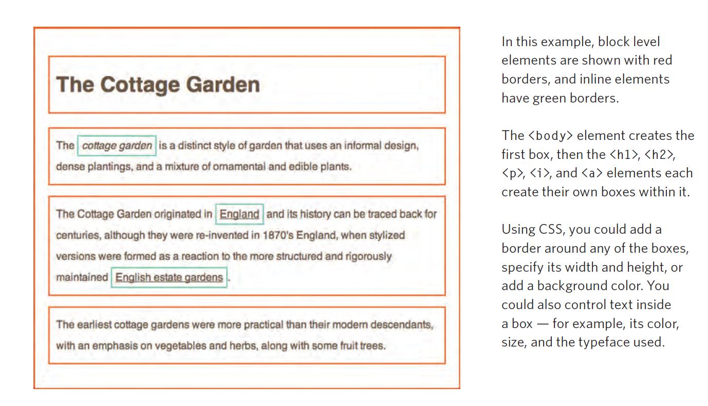

#INTRODUCING CSS

CSS stands for *cascading style sheet* and that is exactly how the selection process for its 'rules' work.


CSS allows the user to create rules that specify how the content should appear. It is purely for visual design purposes.

__*The key to understanding CSS is to imagine that there is a box around every single HTML element*__

Now this is where the block elements and inline elements also come into play; *by using CSS you can edit the 'boxes' around said elements*... more specifically, CSS allows you to create __RULES__ that control the way that each individual box is presented:



###RULES

CSS works by assciating rules with HTML elements, rules which work in 2 parts: __SELECTOR__ & __DECLARATION__

  * The __Selector__: Indicates which element the rule applies to
  * The __Declaration__: Indicates how the elements referred to should be styled, which itself is split into 2 parts:
    * The __Properties__: Show what aspects of the element you want to change (colour, font, boarder, height, width etc)
    * The __Value__: Specify the settings for said property (blue, arial, top, 30, 40)


```css
(Selector)  (Declaration = property | value)
          p {font-family: Arial;}
```<br />
*You should ALWAYS make a separate style sheet for your CSS!!!*

They are added as ```<link>``` elements to your HTML file, to show your browser where to find them, and is kept in the ```<head>``` tag because it is important but not to be shown to the user.

Again it uses the ```<link href="" type="" rel="">``` method of specification:

```html
<!DOCTYPE html>
  <html>
    <head>
      <title>CSS styling 101</title>
      <link href="./css_stylesheets/stylesheet_1.css" type="text/css" rel="stylesheet" />
    </head>
    <body>
      <h1>Some fancy pants text for you</h1>
      <p> The modern English word green comes from the Middle English and Anglo-Saxon word grene, from the same Germanic root as the words "grass" and "grow".</p>
    </body>
  </html>
```
<br>
###ID SELECTORS

Here are some common selectors in CSS:

  * Universal selector: *
  * Type selector: h1, p
  * Class selector: .note, p.note
  * ID selector: #id
  * Child selector: li>a (targets all ```<a>``` elements of the ```<li>``` element)
  * Descendant selector: p a (targets any ```<a>``` elements that sit inside a ```<p>``` element, EVEN IF other elements are nested between them)
  * Adjacent sibling selector: h1+p (targets the *first* ```<p>``` tag after any ```<h1>``` tag, but NOT ny other)
  * General sibling selector: h1~p (if you had 2 or more ```<p>``` tags that were siblings of the ```<h1>``` tag this rule would apply to them)

If there are 2 or more rules that apply to a stylesheet then the later will overrule the former, also, if one rule is more specific than the other, the more specific will overrule the other.

####__TIP :__*You can put !important on the end of a rule in order to make the browser understand that it is more important than any other rule that might conflict with it*

INHERITANCE IS KEY! if you specify font or colour to the ```<body>``` element then most of the child elements will adapt as a result


