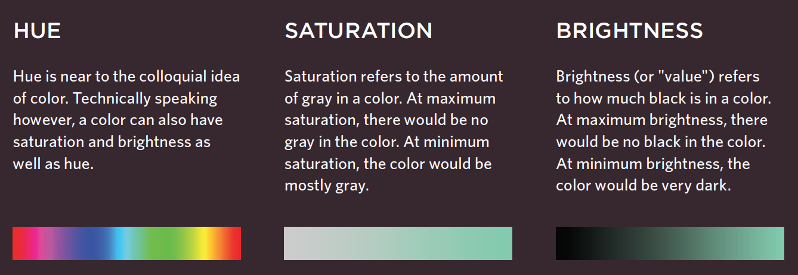

#COLOUR BASICS IN CSS

Every colour you see on a computer is made of 3 colours - Red, Green and Blue.

There are 3 main ways to specify colour:

  * RGB values: Express the colour by the amount of red/ green/ blue is needed to create said colour
    * ```p { color: rgb(100,100,90); }```
  * HEX code: These are 6 digit codes which use letters and numbers to represent the colour - same principal as above - only you use the # symbol and dont need ()
    * ```p { color: #ee3e80; }```
  * Colour names: There are 147 predefined 'colour names' that are recognised by browsers, but considering the amount that are out there this technique can be limiting
    * ```p { color: #ee3e80; }```

By far the Hex code is the most commonly used

__HUE, SATURATION, AND LRIGHTNESS__



The hsl | hsla colour property is new to CSS and used to specify colours in a more specific way, and is representational of Hue, Saturation, and Lightness: ```background-color: hsla(0,100%,100%,0.5);}```

Hue is what we think of as a typical colour chart
Saturation is the amount of GRAY in a colour, aka thinning it out - how much colour is there, a faded t-shirt if you will
Lightness is the amount of BLACK there is in a colour, aka the darkest would be black while the least black would be the most powerful representation of said colour

Contrast and opacity is also important, contrast is a result of the colours you choose whereas opacity is a setting in CSS, a value setting of anywhere between 0.0 - 1.0.

the first example shows how to specify the opacity of an element AND its child elements, whereas the second uses the __rgba__ value which only effects the element specified NOT the child elements:

```css
p {
  background-colour: #ee3e80;
  opacity: 0.5;
}

p {
  background-colour: (0,0,0);
  opacity: (0,0,0,0.5);
}
```
<br />
There is also the hover option, which is fun to play with:

```css
p {
  color: #E66572;
  font-family: "Comic Sans MS", cursive, sans-serif;
  opacity: 0.2;
}

p:hover {
  opacity: 1.0;
}
```


