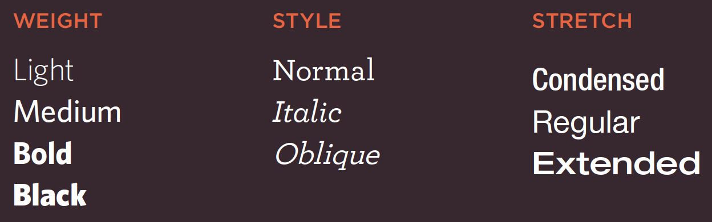
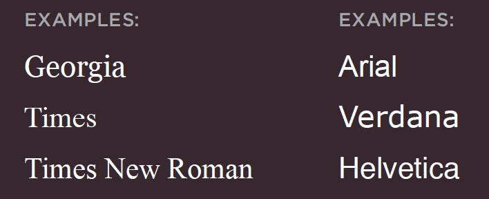
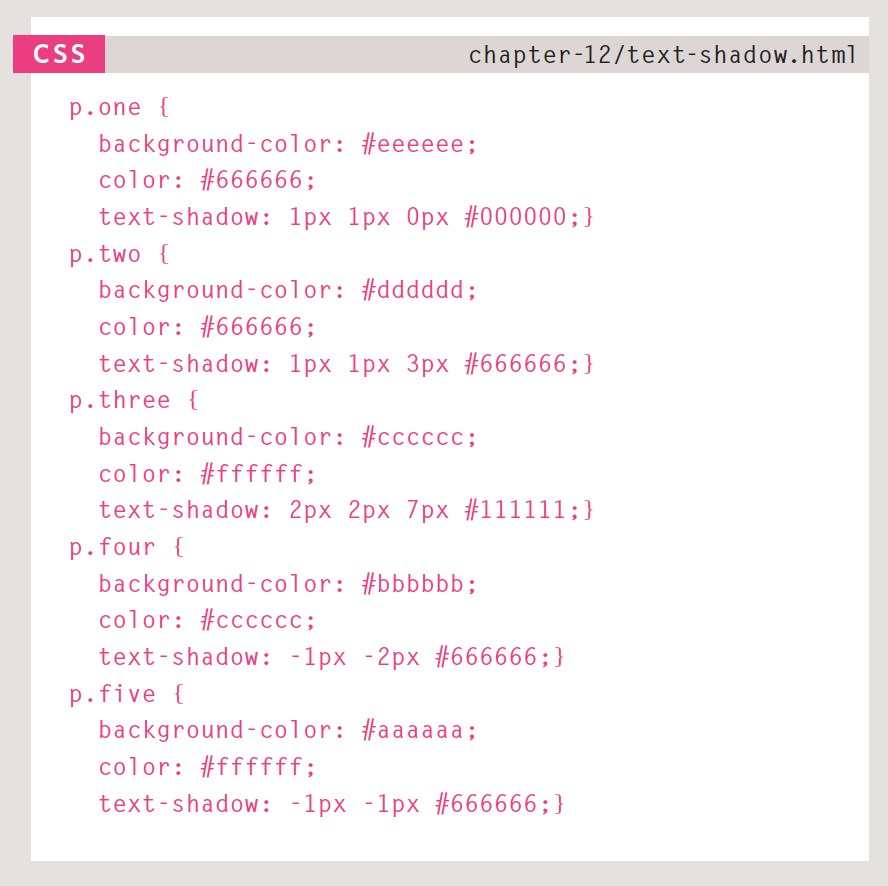
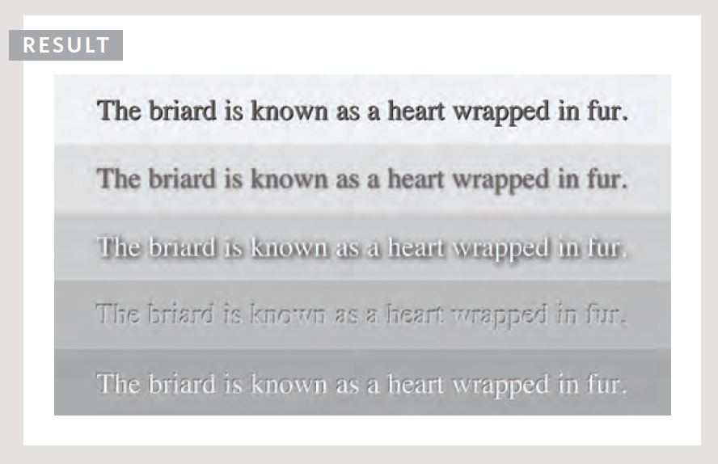

#TEXT BASICS IN CSS

Text comes in :

__WEIGHT, STYLE & STRETCH:__ 
```css
p {
  font-family: arial, sans-serif;
  font-weight: bold;
  font-style: italic;
  font-stretch: extended;
}
```
__SERIF & SANS-SERIF:__ 

CSS needs the font-family and the size for text

  * The default for browsers is __16px__*
  * Size comes in either __pixels__ or __percentage__ (remember that pixels are FIXED!)
  * __em__ is the width of the letter 'm' and is used as a point of measure

```css
body {
  font-family: Arial, verdana, sans-serif;
  font-size: 12px; <!-- 75% | 0.75em -->
}

h1 {
  font-size: 200%; <!-- 24px | 1.5em -->
}

h2 {
  font-size: 1.3em; <!-- 18px | 150% -->
}
```
<br>

The ```@font-face``` allows you to use a font even if the user does not have it installed on their own computer/ browser, by allowing you to specify the path to a copy of the font, which will be automatically downloaded if it is not already on the machine:

```css
@font-face {
  font-family: Nexa rust;
  src: url('file:///Users/AnnaMarie/Desktop/im_a_fantastic_developer/html_css_ducket/css/chapter_2_colour/css_test_3.html');
}

h1 {
  font-family: Nexa rust;
}
```
<br>
Different browsers support different font formats so several variations can be required *(fontsquirrel will easily convert them for you: www.fontsquirrel.com/fontface/generator)*

###TIPS AND TRICKS

The __uppercase__, the __lowercase__, and the __capitalize__ text-transform rules:

```css
h3 {
  text-transform: capitalize;
}
```
<br>
Then there is the ```text-decoration``` options

  * __none__: removes any decoration already present
  * __underline__: underlines
  * __overline__: adds a line over the text
  * __line-through__: puts a line through
  * __blink__: animates the text to make it turn off and on, aka, 'blink' effect
<br>
    * __line-height__: the difference between font-size and line-height is equivalent to the leading (the space between lines of text). It is better to give the value in *em* so that the gap between is relative to the size of text used.
    * __letter-spacing__: Known as 'kerning', is good good for headings if it is all in uppercase (em)
    * __word-spacing__: Default is usually about 0.25em
    * __text-align__: left/ right/ centre/ __justify__ - this means every line should fit to the width of the page apart from the last one
<br>
  * __vertical-align__: This is to be used with ```*<em>,  and <strong>*``` NOT TEXT aka ```<div> | <p>```. They have similar properties:
    * sub | super | top | text-top | middle | bottom | text-bottom | length(em) | percentage(of line height)
  * __text-indent__: obvious, but can also take a negative value which means the text is still on the page for search engines to find, but not used visually on the browser, aka: ```p { text-indent: -9999px ;}```

__text-shadow__: This one is quite complex, it is used to create a darker version of the word behind it that is slightly offset OR an embossed effect by doing the same thing but with a lighter colour instead. It is written out in 3 sometimes 4 properties, the first indicates *how far to the left or right the shadow should fall*. The second property *indicates the distance on the top/ bottom the shadow should fall. The third is optional and specifies *the amount of blur on the shadow*. Finally there is the *colour*.



###PSEUDO-ELEMENTS/ -CLASSES

Pseudo-'' acts like an extra aspect in the code that can be edited, they can be recognised by their attachment to the 'original' aspect vis the ':' symbol.

For example, the h1 is an element to edit, but you can also alter the first-letter in it. The Pseudo-classes are the same principal but for class elements. The most common example are below:

```css
elements:

p.intro:first-letter {
  font-size: 200%;
}

p.intro:first-line: {
  font-weight: bold;
}

classes:

a:link {
  color: deeppink;
  text-decoration: none;
}

a:visited {
  color: black;
}

a:hover {
  color: blue;
  text-decoration: underline;
}

a:active {
  color: cyan;
}

a:focus {
  color: orange;
}
```
<br>


