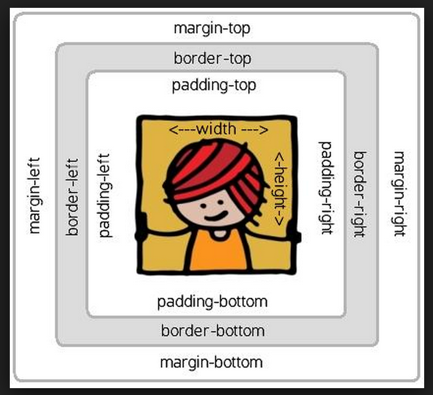
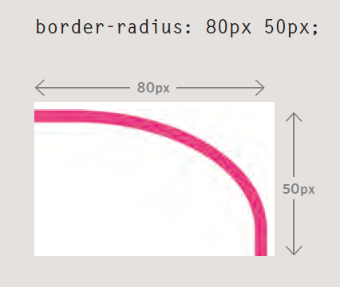

#THE BASICS OF BOXES

While __px__ will give the designer more control over the size of their product, if measured in __%__ or __em__, it will mean that the design is more flexible.

__%__ means that the box is relative to the containing box/ window.
__em__'s mean that the box is relative to the size of the containing text, which gives the designs the ability to change across multiple devices more easily.

```Min-width/ height``` and ```max-width/ height```...need I say more...

Should your content reach outside the box, you have the overflow option:
```p.one { overflow: hidden; } OR p.one { overflow: scroll; }```

##BOARDER, MARGIN & PADDING

PADDING: The space between the border of a box (Boarder) and any content within it, aka the image used for example. Pixels is most commonly used measuring tool
BOARDER: Separates the edge of one box to the other, aka the margin and the padding.
MARGIN: The outer box, after the boarder. Pixels is the most commonly used measuring tool

You can further specify if you want the *top*, *right*, *bottom*, *left* width [NOTICE IT GOES CLOCKWISE] individually as so:
```p.one: { boarder-width: 1px 4px 10px 4px; }```



Boarder style properties can vary, and be very useful:

```p.one { boarder-style: inset; }```
dashed, double, groove, ridge, dotted, solid, outset- looks like its coming out of the screen, inset- embedded

as can their colours:
```p.one { boarder-color: #red #0088dd #ee3e80 #orange; }```

*Boarders also allow us to use a shorthand to set the width, style and color all in one property!*
*make sure they follow that order*
```p.one { width: 300px; boarder: 6px dotted #pink; }```

####CENTER
In order to __center__ a box on a page, you need to set the width of the box, and set the left and right-margin to 'auto'

####INLINE | INLINE-BLOCK | NONE
To turn lists into line or blocks into line elements just use the ```inline | bock | inline-block | none``` elements. Inline-block causes the block-level element to act like a line element, but the rest of the block to stay the same. None element hides it from the page as if it was never there in the first place...
```p.one { display: inline; } p.two { display: none; }```

####VISIBILITY
Visibility element hides the boxes from the users view but shows its absence. ```p.ome { visibility: hidden }```

####BOARDER-IMAGE
__boarder-image__ property is very interesting, it takes a background image and SLICES it into 9 pieces. The 4 corner pieces are always placed as they are cut but the 'side' pieces can be stretched or repeated.
This property requires a *boarder width*, plus 3 sets of information:

  * The URL
  * WHere to slice
  * what to do with the edge pieces (*stretch, repeat or round* - round is like repeat but fits the image to scale better)

The extra webproperties are to make sure that the image shows up clearly in all browsers (chrome/ firefox/ safari etc)

```css
p.two {
  -moz-border-image: url("./images_4/.png")
    11 11 11 11 stretch;
  -webkit-border-image: url("./images_4/.png")
    11 11 11 11 stretch;
  -border-image: url("./images_4/.png")
    11 11 11 11 stretch;
}
```<br>
####BOX SHADOW
The ```box-shadow``` effect works the same as the text-shadow property, which means you need to use at least 2 values as well as colour (so technically you can use 2/3/4). The potential shadow effects include:

__horizontal offset__ - negative values position the shadow to the left of the box
__vertical offset__ - negative values position the shadow to the top of the box
__blur distance__ - if omitted the shadow is solid like a boarder
__spread of shadow__ - will cause the shadow to expand in all directions (negative will make it contract)

```css
p.three {
  -moz-box-shadow: -5px -5px #orange;
  -webkit-box-shadow: -5px -5px #777777;
  box-shadow: -5px -5px #888888;
}
p.FOUR {
  -moz-box-shadow: 0px 0px 5px 5px #orange;
  -webkit-box-shadow: 0px 0px 5px 5px #777777;
  box-shadow: 0px 0px 5px 5px #888888;
}
p.five {
  -moz-box-shadow: inset 0px 0px 0px 5px #orange;
  -webkit-box-shadow: inset 0px 0px 0px 5px #777777;
  box-shadow: inset 0px 0px 0px 5px #888888;
}
```<br>
####BOARDER-RADIUS (rounded corners)
  The property shows the value of the size of the radius pixels, and each corner can be separate or rather have a separate value, of which you can use the shorthand of ```p.one { border-radius: 6px 15px 15px 6px; }```:
```css
p.three {
  border: 10px solid #cccccc;
  padding: 30px;
  width: 300px;
  text-align: justify;
  border-radius: 12px;
  -moz-border-bottom-left-radius: 12px;
  -webkit-border-bottom-left-radius: 12px;
}
```<br>

####More complex shapes
To do so, you can specify the different distances for the horizontal and the vertical parts of the rounded corners:



its best to use the shorthand if you want to be more specific:
```css
p.three {
  border-radius: 1em 4em 1em 4em / 2em 1em 2em 1em;
  -moz-border-radius: 1em 4em 1em 4em / 2em 1em 2em 1em;
  -webkit-border-radius: 1em 4em 1em 4em / 2em 1em 2em 1em;
}
```


